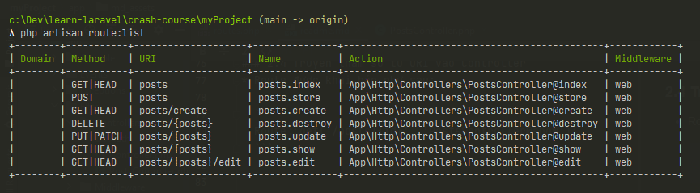

# HỌC LARAVEL CƠ BẢN - EDWIN DIAZ
## 1. Routes
> Địa chỉ URL trên thanh trình duyệt
* Dùng thông qua class Route và các phương thức static:
    * get
    * post 
    * ...
    
* Ví dụ:
    ```phpt
    Route::get('/', function () {
        return view('welcome');
    });
    ```
  Khi truy cập đến địa chỉ root, hàm closure được gọi và trả về view tương ứng.

### 1.1 Truyền tham số trên địa chỉ URL

```phpt
Route::get('/posts/{id}', function ($id) {
    return "Post with id: " . $id;
})
->where('id', '[0-9]+');
```
Ví dụ với resource posts, khi cần truy cập tới 1 bài post cụ thể, ta truyền thêm tham số id của bài post vào địa chỉ URI. Tham số id này được tự động truyền vào hàm closure để ta có thể sử dụng ngay.

Ta có thể dùng regex để xác định string pattern của tham số. Chẳng hạn như ví dụ trên, ta chỉ cho phép tham số id chứa các số từ 0-9.

### 1.2 Đặt tên cho route | Naming Routes
```phpt
Route::get('/admin/posts/thisisalongurl', array('as' => 'admin.posts',  function () {

    $url = route('admin.posts');

    return 'This url is posts admin page, ' . $url;
}));
```
Thay vì phải ghi nhớ địa chỉ URI dài loằng ngoằng như */admin/posts/thisisalongurl*, chúng ta có thể tạo nickname cho nó. Chẳng hạn trong đoạn code trên, ta thay thế địa chỉ URI ban đầu với tên gọi ngắn hơn là admin.posts, để truy cập đến địa chỉ URL nguyên bản, ta dùng phương thức **route()** có sẵn.

Ví dụ khi sử dụng naming route trong thẻ ```<a>```:
```phpt
<a href="route(admin.posts)">Go to admin posts page</a>
```

### 1.3 Tài liệu tham khảo:
[HTTP Routing | Laravel v 5.2](https://laravel.com/docs/5.2/routing)

<hr>

## 2. Controllers
> Class trung gian giữa Model và View trong mô hình MVC. Controller đóng vai trò nhận dữ liệu tương ứng từ Database thông qua class ở Model và truyền dữ liệu vừa nhận được vào View để hiển thị lên màn hình.

### 2.1 Tạo controller
Tạo controller nhanh chóng thông qua ```php artisan```:

```php artisan make:controller PostsController```

Mở terminal và gõ câu lệnh trên, sau đó 1 controller sẽ được tự động tạo ra với tên gọi PostsController.php

### 2.2 Tạo controller nhanh tương ứng thao tác CRUD
Với 1 số controller thực hiện thao tác CRUD, ta có thể nhanh chóng tạo ra controller với các phương thức có sẵn thông qua câu lệnh như sau:

```php artisan make:controller --resource PostsController```

Sau khi kết thúc câu lệnh, ta sẽ có 1 controller với tên gọi PostsController và các phương thức được định nghĩa sẵn

### 2.3 Route sử dụng controller
Khi đã tạo controller, lúc này ta có thể khai báo các route như sau:

```phpt
Route::get('/posts', 'PostsController@index');
```

Trong ví dụ trên, khi người dùng truy cập vào URI: ```/posts```, phương thức ```index()``` bên trong class ```PostsController``` sẽ được gọi. 

### 2.4 Truyền tham số từ URI vào Controller
* Route được khai báo như sau:

  ```
  Route::get('/posts/{id}', 'PostsController@show');
  ```


* Phương thức ```show()``` của class ```PostsController``` sẽ được thiết kế để nhận vào tham số ```id```:
  ```phpt
  public function show($id)
  {
      return 'Specific post with id of ' . $id;
  }
  ```
  
###2. 5 Route với Resources
Ta khai báo route như sau:
```phpt
Route::resource('/posts', 'PostsController');
```
Chương trình sẽ tự động tạo ra 1 danh sách Route tương ứng với các phương thức tương ứng trong controller ```PostsController```:



### 2.6 Tài liệu tham khảo
[Controllers | Laravel v 5.2](https://laravel.com/docs/5.2/controllers)

<hr>

## 3. Views
> View nằm trong đường dẫn /resources/views. Laravel sử dụng blade làm template engine.
> Controller trả về view tương ứng.

### 3.1 Hiển thị view
Trong ví dụ sau, người dùng truy cập đến trang contact: ```/contact```, chương trình sẽ gọi phương thức ```contact``` trong controller ```PostsController```. Phương thức ```contact``` sẽ như thế này:

```phpt
public function contact()
{
    return view('contact');
}
```

### 3.2 Truyền dữ liệu vào view
Ta có thể truyền dữ liệu vào view thông qua các cách như sau:
1. Dùng phương thức ```with```:
   ```phpt
    public function show($id)
    {
        $title = 'Amazing post';
        $author = 'Trong Hieu';

        return view('post')->with('id', $id);
    } 
   ```
2. Dùng hàm ```compact```:
    ```phpt
    public function show($id)
    {
        $title = 'Amazing post';
        $author = 'Trong Hieu';

        return view('post', compact('id', 'title', 'author'));
    }
    ```
   Dùng hàm ``compact``, ta có thể nhanh chóng truyền nhiều dữ liệu vào ```view``` 1 cách nhanh chóng. Dữ liệu truyền vào sẽ theo dạng *name - variable*, nếu name trùng tên với variable thì ta có thể rút gọn. Ở ví dụ trên, chuỗi ```'id'``` tương ứng với biến ```$id```
   
Sử dụng biến trong blade:
```phpt
<body>
  <div class="container">
      <div class="content">
          <h1>Post detail page for post with id of {{ $id }}</h1>
          <p>{{ $title }}</p>
          <p>{{ $author }}</p>
      </div>
  </div>
</body>
```
Ta có thể truy cập đến các biến được truyền vào bằng cách đặt tên biến tương ứng bên trong cụm ```{{ }}```.
### 3.3 Tài liệu tham khảo
[Views | Laravel v 5.2](https://laravel.com/docs/5.2/views)

<hr>

## 4. Laravel Blade template engine
> Template engine được sử dụng trong Laravel.

### 4.1 Master layout
Trang được dùng chung cho tất cả các trang web khác, thường đặt tên là ```app.blade.php```.

Dùng từ khóa ```@yield``` để tạo ra 1 ```placeholder``` để các trang khác chèn dữ liệu vào. Ví dụ về master page:
```phpt
<!DOCTYPE html>
<html lang="vi">
<head>
    <title>Laravel</title>
</head>
<body>
<div class="container">
    <div class="content">
        @yield('content')
    </div>
</div>

@yield('script')
</body>
</html>
```
Ở ví dụ trên, ta tạo ra 2 ```placeholder```:
* ```content```: chèn nội dung
* ```script```: chèn đoạn script

Các trang blade khác tiến hành kế thừa từ trang master layout và chèn dữ liệu tương ứng vào.
```phpt
@extends('layouts.app')

@section('content')
    <h1>Post detail page for post with id of {{ $id }}</h1>
    <p>{{ $title }}</p>
    <p>{{ $author }}</p>
@endsection

@section('script')
    <script>
        console.log('Post detail page');
    </script>
@endsection
```
Ở ví dụ trên, ```@extends``` thể hiện rằng ta sẽ tạo 1 trang mới từ việc mở rộng template có sẵn tên là ```app``` nằm trong thư mục ```layouts```.
Tiếp đến, ta dùng ```@section``` và tên tương ứng từ chỉ thị ```@yield``` ở layout app để tiến hành chèn nội dung vào.

### 4.2 Tài liệu tham khảo
[Blade Template Engine | Laravel v 5.2](https://laravel.com/docs/5.2/blade)

<hr>

## 5. Laravel Database Migration
> Code First. Tạo các bảng trong cơ sở dữ liệu thông qua các tập tin migration được viết bằng code php.
> Tất cả migration được lưu trữ tại đường dẫn ```/databases/migrations```.

### 5.1 Chỉnh sửa cài đặt trong file ```.env```
* Lưu trữ các thông tin quan trọng
* Sử dụng file ```.env.example``` để làm ví dụ khi push lên github

### 5.2 Thực hiện migration
Dùng câu lệnh có sẵn từ ```php artisan```:
```phpt
php artisan migrate
```
Sau khi thực hiện câu lệnh trên, các bảng tương ứng sẽ được tự động tạo vào cơ sở dữ liệu ```MySQL```.

### 5.3 Tạo mới migration
Dùng câu lệnh có sẵn:
```phpt
php artisan make:migration create_posts_table --create="posts"
```
Sau khi thực hiện lệnh trên, 1 file migration mới sẽ được tạo ra tại đường dẫn ```/databases/migrations```
và được tự động đặt tên như sau: ```2021_01_31_122445_create_posts_table.php```.

### 5.3 Thêm cột mới vào bảng đã có sẵn
Dùng trong trường hợp trong bảng đã có nhiều dữ liệu, ta không muốn xóa đi để migrate từ đầu, chỉ muốn thêm cột mới vào.

Sử dụng câu lệnh có sẵn:
```phpt
php artisan make:migration add_status_column_to_posts_table --table="posts"
```
Sau khi thực hiện lệnh trên, 1 file migration mới sẽ được tạo ra tại đường dẫn ```/databases/migrations```
và được tự động đặt tên như sau: ```2021_01_31_123649_add_status_column_to_posts_table.php```.

### 5.4 Xóa tất cả các bảng
```phpt
php artisan migrate:reset
```

### 5.5 Xóa tất cả các bảng và chạy lại migration từ đầu
```phpt
php artisan migrate:refresh
```

### 5.6 Kiểm tra trạng thái migration
```phpt
php artisan migrate:status
```

### 5.7 Tài liệu tham khảo
[Laravel Database Migrations | Laravel v 5.2](https://laravel.com/docs/5.2/migrations)

<hr>

## 6. Tạo query với Laravel | Raw SQL Query
> Tạo các truy vấn SQL thông qua lớp đối tượng DB sử dụng công nghệ PDO

### 6.1 Create
```phpt
Route::get('/insert', function () {

    DB::insert('INSERT INTO posts(title, body) VALUES (?, ?)', [
        'PHP with Laravel',
        'Laravel is so awesome!'
    ]);

});
```
Khi người dùng truy cập vào địa chỉ ```/insert```, hàm ```closure``` sẽ được chạy. Phương thức tĩnh với tên gọi ```insert``` thuộc lớp đối tượng ```DB``` sẽ được gọi với câu truy vấn tương ứng.
Sau khi kết thúc câu lệnh, 1 bản ghi mới sẽ được thêm vào MySQL.

Phương thức ```insert``` sử dụng công nghệ ```PDO``` để tạo và thực thi câu truy vấn.

### 6.2 Read
```phpt
Route::get('/read', function () {

    $results = DB::select('SELECT * FROM posts');
    dd($results);
    
});
```
Dữ liệu trả về là 1 mảng kết quả, được lưu trữ vào biến ```$results```. Với mỗi bản ghi được biến đổi thành 1 đối tượng.
Trong đoạn code trên, dữ liệu trả về có dạng như sau:
```phpt
array:1 [
  0 => {
    "id": 1
    "title": "PHP with Laravel"
    "body": "Laravel is so awesome!"
    "created_at": null
    "updated_at": null
    "is_public": 0
  }
]
```

### 6.3 Update
```phpt
Route::get('/update', function () {

    $numberOfRowsEffected = DB::update("UPDATE posts SET title = 'Updated title', body = 'Updated body' WHERE id = ?", [
        1
    ]);
    dd($numberOfRowsEffected);
    
});
```
Dữ liệu trả về là số dòng bị tác động sau khi thực hiện câu lệnh. Trong ví dụ trên, phương thức ```update```
trả về số dòng bị tác động = ```1```.

### 6.4 Delete
```phpt
Route::get('/delete', function () {

    $numberOfRowsEffected = DB::delete('DELETE FROM posts WHERE id = ?', [
        1
    ]);
    dd($numberOfRowsEffected);

});
```
Dữ liệu trả về là số dòng bị xóa sau khi thực hiện câu lệnh. Trong ví dụ trên, phương thức ```delete``` trả về số dòng bị xóa = ```1```.

### 6.5 Tài liệu tham khảo
[Raw SQL Query | Laravel v 5.2](https://laravel.com/docs/5.2/database)

<hr>

## 7. Eloquent ORM
> Hỗ trợ thao tác cơ sở dữ liệu thông qua các phương thức được cung cấp sẵn của lớp Model

### 7.1 Tạo model mới
Sử dụng câu lệnh có sẵn:
```phpt
php artisan make:model Post
```
Sau khi thực hiện câu lệnh trên, 1 class sẽ được tạo ra tại đường dẫn ```/app``` và được đặt tên ```Post.php```.

Class này kế thừa từ lớp ```Model```, có hình dạng như sau:
```phpt
<?php

namespace App;

use Illuminate\Database\Eloquent\Model;

class Post extends Model
{
    //
}
```
Model ```Post``` này mặc định sẽ là ánh xạ tương ứng của 1 bảng tên là ```posts``` bên trong cơ sở dữ liệu.
Trong trường hợp, bảng trong cơ sở dữ liệu có tên khác với Model, ta có thể override thuộc tính trong model để chỉ định rõ tên bảng mà model ánh xạ tới. 
Cú pháp sẽ như sau: 
```phpt
protected $table = 'my_table'
```
Tương tự như vậy, model này cũng mặc định khóa chính trong bảng được đặt tên là ```id```.
Trong trường hợp khóa chính có tên khác, ta cũng có thể override thuộc tính. Cú pháp như sau:
```phpt
protected $primaryKey = 'my_primary_key'
```

### 7.2 Read
* **Đọc tất cả bản ghi**
```phpt
Route::get('/read', function () {

   $posts = \App\Post::all();
   dd($posts);
   
});
```
Trong đoạn mã phía trên, khi người dùng truy cập vào địa chỉ ```/read```, phương thức tĩnh có tên ```all``` được định nghĩa trên Model ```Post``` sẽ được gọi.
Kết quả trả về là 1 mảng các đối tượng, mỗi đối tượng ánh xạ với 1 bản ghi từ bảng có tên ```posts``` trong cơ sở dữ liệu.
  
* **Tìm kiếm 1 bản ghi theo khóa chính**
```phpt
Route::get('/find/{id}', function ($id) {

    $post = \App\Post::find($id);
    dd($post);

});
```
Trong đoạn mã phía trên, khi người dùng truy cập vào ```/find/1```, phương thức tĩnh có tên `find` được định nghĩa trên Model `Post` sẽ được thực thi cùng với khóa chính là giá trị của biến ```$id``` được truyền thông qua URI tham số.
Kết quả trả về là đối tượng tương ứng với khóa chính được truyền vào, hoặc `null` nếu không tìm thấy kết quả.
  
* **Tìm kiếm bản ghi theo điều kiện**
```phpt
Route::get('/where/private', function () {

    $posts = \App\Post::where('is_public', 0)->orderBy('id', 'desc')->take(5)->get();
    dd($posts);

});
```
Trong đoạn mã phía trên, khi chương trình sẽ lấy tất cả các Post chưa được xuất bản, sau đó sắp xếp giảm dần theo ```id```, chỉ định lấy 5 phần tử đầu tiên và cuối cùng chaining phương thức ```get``` để lấy về dữ liệu.
Kết quả trả về là 1 mảng các đối tượng, với mỗi đối tượng tương ứng với 1 bản ghi trong cơ sở dữ liệu. Nếu không có kết quả, hàm `count($posts)` trả về giá trị 0.

### 7.3 Create
* **Phương thức `save()`**
```phpt
Route::get('/insert', function () {

    $post = new \App\Post();

    $post->title = 'New ORM post';
    $post->body = 'Eloquent is awesome';

    $result = $post->save();

    dd($result);

});
```
Phương thức `save()` có thể được dùng để tạo mới 1 bản ghi, trong trường hợp này, ta tạo 1 `instance` từ model `Post`.
Sau đó gán các giá trị tương ứng và thực hiện gọi phương thức `save()`. Phương thức này trả về kết quả dạng `boolean`. 
* `true`: chèn thành công
* `false`: chèn thất bại

(*Giữ phím `Ctrl` và click chuột vào phương thức `save` khi code trên PhpStorm để xem cách viết phương thức này*).

```phpt
Route::get('/insert/{id}', function ($id) {

    $post = \App\Post()::find($id);

    $post->title = 'New ORM post';
    $post->body = 'Eloquent is awesome';

    $result = $post->save();

    dd($result);

});
```
Phương thức `save()` còn được dùng để cập nhật bản ghi, trong trường hợp ta gọi phương thức `save()` trên bản ghi đã tồn tại (khóa chính đã tồn tại), 
phương thức này sẽ tự động cập nhật bản ghi này.

* Phương thức `create()`
> Được dùng phổ biến khi thao tác với `form`

```phpt
Route::get('/create', function () {

    $newPost = \App\Post::create([
       'title' => 'Laravel with Eloquent ORM',
       'body' => 'WOWWWWWWWWWWWWWWWWWWWWWWWWWWWWWWWW'
    ]);

    dd($newPost);
    
});
```
Mặc định, `Laravel` sẽ không cho phép chương trình tạo mới dữ liệu do lo ngại vấn đề bảo mật.
Để chỉ rõ cho `Laravel` biết việc thêm mới dữ liệu sẽ an toàn, ta cần cấu hình lại chức năng `MassAssignment`.

Ta cấu hình lại thông qua việc `override` thuộc tính `$fillable` ở Model `Post`:
```phpt
class Post extends Model
{
    protected $table = 'posts';
    protected $primaryKey = 'id';

    protected $fillable = [
      'title',
      'body'
    ];
}
```
Kết quả trả về từ phương thức `create()` là 1 `instance` mới của Model `Post`, được tạo ra từ mảng dữ liệu mà ta truyền vào.

### 7.4 Update
> Ta có thể `update` 1 bản ghi thông qua phương thức `save()`, đây là cách thường dùng.
> Tuy nhiên, Laravel cũng cung cấp 1 phương thức riêng cho việc `update` dữ liệu

```phpt
Route::get('/update/{id}', function ($id) {

    $result = \App\Post::find($id)->update([
        'title' => 'Updated title for post with id of ' . $id,
        'body' => 'Updated body for post with id of ' . $id
    ]);
    dd($result);

});
```
Trong đoạn mã phía trên, chương trình tìm ra bản ghi tương ứng với `$id` truyền vào, sau đó thực hiện phương thức `update` trên đối tượng tìm được.
Kết quả trả về có dạng `boolean`:
* `true`: cập nhật thành công
* `false`: có lỗi trong quá trình cập nhật

### 7.5 Delete
* Xóa 1 bản ghi
```phpt
Route::get('/delete/{id}', function ($id) {

    $post = \App\Post::find($id);
    $post->delete();

});
```
Tìm bản ghi tương ứng với `$id` truyền vào, sau đó gọi phương thức `delete()` trên đối tượng tìm được.
Bùm, bản ghi bay màu.

* Xóa nhiều bản ghi
```phpt
Route::get('/deletemany', function () {
    
    \App\Post::destroy([1, 2, 3]);
    
});
```
Gọi phương thức tĩnh `destroy` trên Model và truyền vào 1 mảng với mỗi phần từ là `id` của bản ghi cần xóa.

* Xóa nhiều bản ghi với phương thức `where()`
```phpt
Route::get('/deletewhere', function () {
   
    \App\Post::where('is_public', 0)->delete();
    
});
```
Phương thức `where()` tìm ra danh sách các Post chưa được xuất bản, sau đó ta gọi phương thức `delete` trên kết quả trả về để tiến hành xóa bỏ khỏi cơ sở dữ liệu.

### 7.5 Trashing 
> Xóa tạm thời, đưa vào thùng rác khi không cần hoặc móc từ thùng rác ra, restore về trạng thái ban đầu khi cần dùng.

#### 7.5.1 Sử dụng `SoftDeletes` trong Model `Post`
```phpt
<?php

namespace App;

use Illuminate\Database\Eloquent\Model;
use Illuminate\Database\Eloquent\SoftDeletes;

class Post extends Model
{
    use SoftDeletes;

    protected $dates = ['deleted_at'];
    
    protected $table = 'posts';
    protected $primaryKey = 'id';

    protected $fillable = [
      'title',
      'body'
    ];
}
```

Ta sử dụng `SoftDeletes`, đồng thời khai báo thêm 1 biến tên `deleted_at` để lưu giữ trạng thái của Model.
* `deleted_at == null`: bản ghi đang hoạt động bình thường
* `deleted_at != null`: bản ghi hiện tại đang trong thùng rác

#### 7.5.2 Tạo migration mới
* Tiếp đó, ta tiến hành tạo 1 migration mới để thêm cột `'deleted_at'` vào bảng.
```phpt
php artisan make:migration add_deleted_at_column_to_posts_table --table="posts"
```
Lúc này, migration mới được tạo ra sẽ có dạng như sau:
```phpt
class AddDeletedAtColumnToPostsTable extends Migration
{
    public function up()
    {
        Schema::table('posts', function (Blueprint $table) {
            $table->softDeletes();
        });
    }

    public function down()
    {
        Schema::table('posts', function (Blueprint $table) {
            $table->dropSoftDeletes();
        });
    }
}
```

#### 7.5.3 Tạo route mới và test thử
```phpt
Route::get('/softdelete/{id}', function ($id) {

    $post = \App\Post::find($id);
    $post->delete();

});
```
Ta tiến hành khai báo route và truyền `id` của post cần xóa vào. Sau đó gọi phương thức `delete` trên kết quả tìm được. Lúc này, phương thức `delete` sẽ không xóa bỏ hoàn toàn bản ghi trong cơ sở dữ liệu, mà chỉ đơn giản đặt giá trị `timestamp` tương ứng cho cột `deleted_at`.

Khi ta dùng phương thức `all()` để lấy tất cả bản ghi, ta chỉ lấy được những bản ghi có giá trị cột `deleted_at == null`, tức là chưa bị đưa vào thùng rác. 

#### 7.5.4 Lấy các phần tử trong thùng rác
```phpt
Route::get('/readsoftdelete', function () {

    $trashedPosts = \App\Post::onlyTrashed()->get();
    dd($trashedPosts);

});
```
Chỉ những phần tử trong thùng rác.

#### 7.5.5 Lấy tất cả phần tử, bao gồm trong thùng rác
```phpt
Route::get('/readsoftdelete', function () {

    $trashedPosts = \App\Post::withTrashed()->get();
    dd($trashedPosts);

});
```
Lấy tất cả các phần tử, bao gồm cả các phần tử đang trong thùng rác.

#### 7.5.6 Móc phần tử từ thùng rác ra
```phpt
Route::get('/restore/{id}', function ($id) {

    $posts = \App\Post::onlyTrashed()->where('id', $id)->get();
    $posts[0]->restore();

});
```
Gọi phương thức `restore()` trên phần tử nằm trong thùng rác. Sau khi phương thức được thực thi, giá trị trong cột `created_at` sẽ được đặt bằng `null`.

#### 7.5.7 Xóa vĩnh viễn
```phpt
Route::get('/forcedelete/{id}', function ($id) {

    $posts = \App\Post::onlyTrashed()->where('id', $id)->get();
    $posts[0]->forceDelete();

});
```
Gọi phương thức `forceDelete()` trên phần tử trong thùng rác.

### 7.6 Tài liệu tham khảo
[Eloquent | Laravel v 5.2](https://laravel.com/docs/5.2/eloquent)

## 8. Eloquent ORM | Eloquent Relationships
> Laravel cung cấp chức năng `function as property`, cẩn thận khi khai báo các phương thức xác định quan hệ trong model.

### 8.1 Quan hệ 1 - 1
Giả sử 1 người dùng chỉ có duy nhất 1 post, và 1 post chỉ thuộc về 1 người dùng.
#### 8.1.1 Thêm trường `user_id` vào bảng `posts`
```phpt
<?php

use Illuminate\Database\Schema\Blueprint;
use Illuminate\Database\Migrations\Migration;

class CreatePostsTable extends Migration
{
    public function up()
    {
        Schema::create('posts', function (Blueprint $table) {
            $table->increments('id');
            $table->integer('user_id')->unsigned();
            $table->string('title');
            $table->text('body');
            $table->timestamps();
        });
    }

   public function down()
    {
        Schema::drop('posts');
    }
}
```

#### 8.1.2 Thêm phương thức vào Model `User`
```phpt
<?php

namespace App;

use Illuminate\Foundation\Auth\User as Authenticatable;

class User extends Authenticatable
{
    protected $fillable = [
        'name', 'email', 'password',
    ];

   protected $hidden = [
        'password', 'remember_token',
    ];

    public function post()
    {
        return $this->hasOne('App\Post', 'user_id');
    }
}
```
Phương thức `post` được gọi khi cần lấy `post` thuộc về người dùng.
`Laravel` cung cấp phương thức `hasOne` để chỉ định mối quan hệ 1 - 1. Tham số đầu tiên truyền vào
là Model có mối quan hệ, tham số thứ 2 xác định trường nào dùng để thiết lập quan hệ.

#### 8.1.3 Khai báo route và kiểm tra kết quả
```phpt
Route::get('/user/{id}/post', function ($id) {

    $user = \App\User::find($id);

    $post = $user->post;
    dd($post);

});
```
Kết quả trả về là bài `post` duy nhất tương ứng với `id` của người dùng.

### 8.2 The inverse relationship
> Trong mối quan hệ 1 - 1, thay vì lấy 1 bài `post` thông qua `id` người dùng, thì lúc này, ta có `id` bài post, thông qua `id` này, ta muốn biết người dùng nào đang sở hữu bài post.

#### 8.2.1 Thêm phương thức vào Model `Post`
```phpt
<?php

namespace App;

use Illuminate\Database\Eloquent\Model;
use Illuminate\Database\Eloquent\SoftDeletes;

class Post extends Model
{
    use SoftDeletes;

    protected $dates = ['deleted_at'];

    protected $table = 'posts';
    protected $primaryKey = 'id';

    protected $fillable = [
      'title',
      'body'
    ];

    public function user()
    {
        return $this->belongsTo('App\User');
    }
}
```
Phương thức `user` xác định 1 `post` sẽ thuộc về 1 `user`.

#### 8.2.2 Khai báo route và kiểm tra kết quả
```phpt
Route::get('/post/{id}/user', function ($id) {

    $post = \App\Post::find($id);

    $user = $post->user;
    dd($user);

});
```
Lúc này, ta sẽ tìm kiếm `$post` dựa trên `$id` được truyền vào. 
Sau đó ta tiến hành gọi đến thuộc tính `user` để lấy được người dùng tương ứng với `$post` này.

### 8.3 Quan hệ 1 - nhiều
> Giả sử 1 người dùng có thể có nhiều bài post

#### 8.3.1 Thêm trường dữ liệu trong bảng `posts`
```phpt
<?php

use Illuminate\Database\Schema\Blueprint;
use Illuminate\Database\Migrations\Migration;

class CreatePostsTable extends Migration
{
    public function up()
    {
        Schema::create('posts', function (Blueprint $table) {
            $table->increments('id');
            $table->integer('user_id')->unsigned();
            $table->string('title');
            $table->text('body');
            $table->timestamps();
        });
    }

   public function down()
    {
        Schema::drop('posts');
    }
}
```
Trường `user_id` chỉ định 1 bài `post` chỉ thuộc về 1 người dùng, tuy nhiên 1 người dùng có thể có 1 hoặc nhiều bài post.

#### 8.3.2 Thêm phương thức vào Model `user`
```phpt
<?php

namespace App;

use Illuminate\Foundation\Auth\User as Authenticatable;

class User extends Authenticatable
{
    /**
     * The attributes that are mass assignable.
     *
     * @var array
     */
    protected $fillable = [
        'name', 'email', 'password',
    ];

    /**
     * The attributes that should be hidden for arrays.
     *
     * @var array
     */
    protected $hidden = [
        'password', 'remember_token',
    ];

    public function posts()
    {
        return $this->hasMany('App\Post', 'user_id');
    }
}
```
Phương thức ```posts``` dùng để lấy dữ liệu tất cả bài post liên quan đến người dùng.
`Laravel` cung cấp phương thức `hasMany` để chỉ định rằng đây là mối quan hệ 1 - nhiều.
Tham số đầu tiên là Model quan hệ, tham số thứ 2 là trường dữ liệu để tạo quan hệ.

#### 8.3.3 Khai báo route và kiểm tra kết quả
```phpt
Route::get('/user/{id}/posts', function ($id) {

    $user = \App\User::find($id);

    $posts = $user->posts;
    dd($posts);

});
```
Ta tìm kiếm người dùng tương ứng theo `$id` truyền vào, sau đó gọi phương thức `posts` để lấy danh sách tất cả bài posts thuộc về người dùng này.

> Lưu ý:
> `Laravel` có cái gọi là `method as property`, vì vậy phương thức `posts` không được gọi như truyền thống. Mà chỉ cần trỏ tới như là 1 thuộc tính.

### 8.4 Quan hệ nhiều - nhiều
> Giả sử ta có mối quan hệ giữa `User` và `Role`. 1 `user` sẽ có thể có nhiều `role`, và 1 `role` cũng sẽ có 1 hoặc nhiều `user`.
> Như vậy, ta sẽ có 3 bảng, 1 bảng chứa thông tin `user`, 1 bảng chứa thông tin `role`, và 1 bảng dùng để liên kết 2 bảng này lại, thường được gọi là 
> `lookup table`. Trong `Laravel`, ta có khái niệm `pivot table`.

#### 8.4.1 Tạo bảng `role`
```phpt
php artisan make:model Role -m
```
Câu lệnh phía trên tạo mới 1 Model có tên `Role`, đồng thời flag `-m` chỉ định `Laravel` tạo mới 1 `migration` dành cho bảng `roles`, migration này được 
đặt tên là `create_roles_table`.

#### 8.4.2 Tạo migration cho `pivot table`
```phpt
php artisan make:migration create_roles_users_table --create=role_user
```
**Chú ý:**
* Câu lệnh trên dùng để tạo mới 1 `migration` cho `pivot table`
* Cờ `--create` chỉ định tên của bảng `pivot`, `Laravel` quy ước cách đặt tên như sau:
    * Bảng `pivot` này kết nối 2 bảng là `users` và `roles`
    * Dạng danh từ số ít của 1 bảng này là `user` và `role`
    * Sắp xếp theo thứ tự `a-z` là `role` và `user`
    * Kết nối lại bằng dấu `_`, ta được tên bảng là `role_user`
    * Đây là quy ước đặt tên của `Laravel`, khi đặt tên như vậy, `Laravel` sẽ tự hiểu bảng `role_user` là `pivot table` kết nối giữa bảng `roles` và bảng `users`.
    
#### 8.4.3 Tạo phương thức mới trong Model `User`
```phpt
    public function roles()
    {
        return $this->belongsToMany('App\Role');
    }
```
Phương thức cho này cho phép ta lấy thông tin về tất cả `role` thuộc về `user`

#### 8.4.4 Khai báo route và kiểm tra kết quả
```phpt
Route::get('/user/{id}/role', function ($id) {

    $user = \App\User::find($id);
    $roles = $user->roles()->get();

    dd($roles);

});
```
Tìm kiếm `$user` tương ứng theo `$id` truyền vào, sau đó ta gọi phương thức `roles()`, tiếp tục chaining với phương thức `get()` để lấy về danh sách các `role` thuộc về `$user`. 

### 8.5 Truy cập vào `pivot table`
```phpt
    public function roles()
    {
        return $this->belongsToMany('App\Role')->withPivot(['created_at']);
    }
```
Chỉnh sửa model, chaining phương thức `withPivot` và xác định danh sách các cột cần lấy dữ liệu. 
